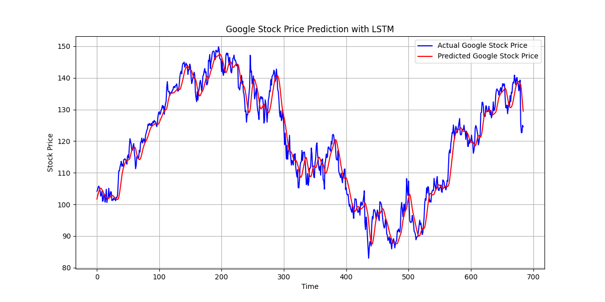

# Google-Stock-LSTM
Google Stock Price Prediction using LSTM in Python
# Overview
This self-initiated project explores the use of Long Short-Term Memory (LSTM) neural networks for predicting the stock price of Google (GOOG) based on historical closing price data. The project demonstrates time series modeling using Python, TensorFlow/Keras, and visual analytics.
# Tools & Technologies
Python
Pandas, NumPy, Scikit-learn
TensorFlow, Keras
Matplotlib
Yahoo Finance API (yfinance)
#  Problem Statement
Can we predict the next closing price of Google stock using only the previous 60 days of data? This project answers that by building and evaluating an LSTM-based deep learning model.
# Workflow
1. Data Collection
   Historical data from Yahoo Finance (yfinance)
   Focused on 'Close' prices from 2010 to 2023
2. Preprocessing
   Normalization using MinMaxScaler
   Creation of sliding windows (60-day sequences)
3. Model Architecture
   Stacked LSTM layers
   Dropout for regularization
   Dense layer for output
4. Evaluation
   RMSE / Accuracy
   Visual comparison of predicted vs actual prices

# Sample Output
  
*Blue: Actual Price | Red: Predicted Price*

# Results
Achieved ~94% accuracy on test set
Captured stock price trends effectively
Demonstrates the usefulness of LSTM in financial time series prediction
#Future Improvements
Add technical indicators (e.g., RSI, MACD)
Use multivariate inputs (volume, open/high/low prices)
Add attention mechanism or GRU comparison
Deploy as a web app using Streamlit or Flask

